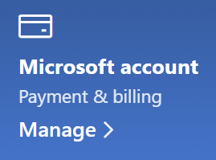

# Microsoft 계정 정보 변경Change my Microsoft account information

[https://account.microsoft.com](https://account.microsoft.com/)으로 이동하고 필요한 경우 로그인합니다.Go to [https://account.microsoft.com](https://account.microsoft.com/) and sign in if necessary. 계정 대시보드로 이동합니다.This will take you to your account dashboard.  

**이름 및 개인 정보 편집****Edit my name and personal information**

1. 계정 대시보드에서 계정 사진과 이름 옆에 **기타 작업 > 프로필 편집**을 클릭합니다.On your account dashboard, next to your account picture and name, click **More actions > Edit profile**.
2. **프로필 편집** 페이지에서 제공된 링크를 통해 프로필 사진, 이름, 생일, 위치 및 표시 언어 설정을 변경합니다.On the **Edit profile** page, use the links provided to change your profile picture, name, date of birth, location, and display language preference. Xbox 또는 Skype 계정 프로필에 연결된 링크에서 계정 관련 세부 정보를 변경할 수 있습니다.Note the links to your Xbox or Skype account profiles, where you can change details specific to these accounts.

**이메일 주소 및 전화 번호 관리****Manage e-mail addresses and phone numbers**

Microsoft 계정에는 하나 이상의 이메일 주소 또는 전화 번호와 연결된 “별칭”이 있습니다.A Microsoft account has one or more e-mail addresses or phone numbers associated with it as “aliases.” 관리하려명 다음을 수행합니다.To manage these:

1. 계정 대시보드에서 계정 사진과 이름 옆에 **기타 작업 > 프로필 편집**을 클릭합니다.On your account dashboard, next to your account picture and name, click **More actions > Edit profile**.
2. **프로필 편집** 페이지에서 **Microsoft 로그인 관리**를 클릭합니다.On the **Edit profile** page, click **Manage how you sign in to Microsoft**. 
3. 계정 별칭 목록이 보이면 목록에 이메일 주소 및 전화 번호를 추가, 삭제하여 관리할 수 있습니다.You will see a list of account aliases, and you can manage the list, including adding and deleting e-mail addresses and phone numbers. 또한 계정에 로그인 시 사용할 수 있는 별칭을 선택할 수 있고, Windows 10 디바이스에 표시될 “기본” 계정 별칭을 선택할 수도 있습니다.Here you can also select which aliases can be used to sign in to the account, and which alias is considered “primary,” which will be displayed on your Windows 10 devices.

**결제 방법, 이름 및 청구 주소 관리****Manage payment methods, as well as name and address for billing** 

1. 계정 대시보드에서 계정 사진과 이름 옆에 **기타 작업 > 프로필 편집**을 클릭합니다.On your account dashboard, next to your account picture and name, click **More actions > Edit profile**.
2. **결제 및 대금 청구**에서 **관리**를 클릭합니다.Under **Payment & billing** click **Manage**.

    

3. 결제 방법과 관련 청구 주소를 추가, 편집 및 제거할 수 있습니다.Here you can add, edit, and remove payment methods and their associated billing addresses. 
