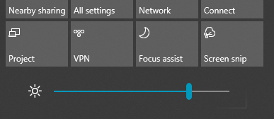

# Windows 10의 화면 밝기 변경Change screen brightness in Windows 10

Windows 10이 버전 1903 보다 최신인 경우 알림 센터에 **밝기 슬라이더**가 있습니다.If your Windows 10 is newer than version 1903, it has a **Brightness slider** in the action center. 알림 센터를 열려면 작업 표시줄의 맨 오른쪽에 **알림** 버튼을 클릭하거나 키보드에서 **Windows home + A**를 누르세요.To open the action center, click the **Notification** button at the rightmost side of your taskbar, or press **Windows home + A** on your keyboard.

Windows 10이 이전 버전일 경우 **[설정 > 시스템 > 디스플레이](ms-settings:display?activationSource=GetHelp)** 로 이동하여 밝기 슬라이더를 찾을 수 있습니다.If your Windows 10 is an earlier version, you can find the brightness slider by going to **[Settings > System > Display](ms-settings:display?activationSource=GetHelp)**.

**참고**:**Notes**:

- 외부 모니터를 사용하는 데스크톱 PC의 경우 기본 제공된 디스플레이 슬라이더의 밝기 변경 기능을 볼 수 없습니다.You might not see the Change brightness for the built-in display slider on desktop PCs that have an external monitor. 외부 모니터의 밝기를 변경하려면 모니터의 컨트롤을 사용하세요.To change the brightness of an external monitor, use the controls on the monitor.
- 데스크톱 PC가 없고 슬라이더가 표시 혹은 작동하지 않는 경우 디스플레이 드라이버 업데이트를 시도해보세요.If you don't have a desktop PC and the slider doesn't appear or work, try updating the display driver. 작업 표시줄의 검색 상자에 **디바이스 관리자**를 입력한 다음 결과 목록에서 **디바이스 관리자**를 선택합니다.In the search box on the taskbar, type **Device Manager**, and then select **Device Manager** from the list of results. **디바이스 관리자**에서 **디스플레이 어댑터**를 선택한 후 디스플레이 어댑터를 선택합니다.In **Device Manager**, select **Display adapters**, then select the display adapter. 디스플레이 어댑터 이름을 길게 누르고 **드라이버 업데이트**를 클릭한 뒤 지침을 따릅니다.Press and hold (or right-click) the display adapter name and click **Update driver**; then follow the instructions.
