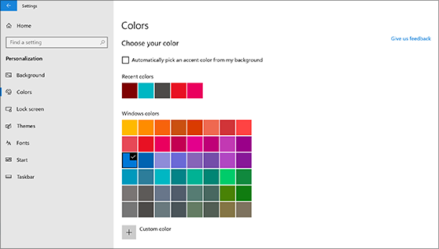
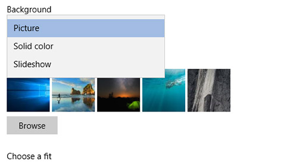

# 데스크톱 배경 및 색 변경

색 설정을 변경하기 위해 시작 설정 개인 설정 색으로 이동한 다음 자신의 색을 선택하거나 배경에서 Windows 색을 끌어오게  >    >    >  합니다.

바탕 화면 배경을 변경하기 위해 시작 설정 설정 배경으로 이동한 다음 그림, 단색 또는 그림 슬라이드   >    >    >  쇼를 만드실 수 있습니다. 

더 많은 데스크톱 배경과 색을 원하세요? 수십 [개의 무료](https://www.microsoft.com/store/collections/windowsthemes) Microsoft Store 테마를 선택하기 위해 웹 사이트를 방문합니다.
