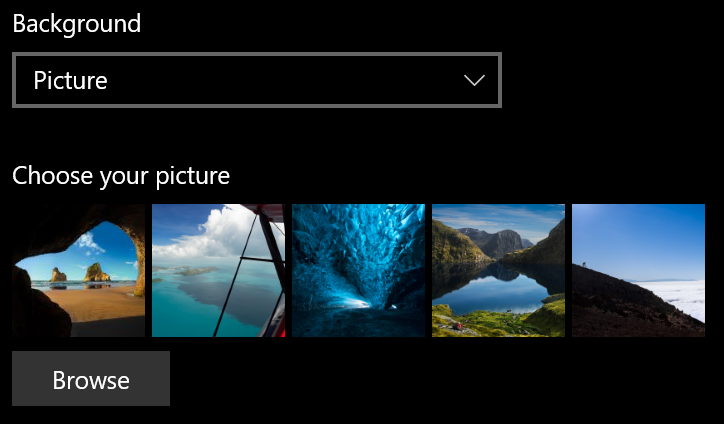
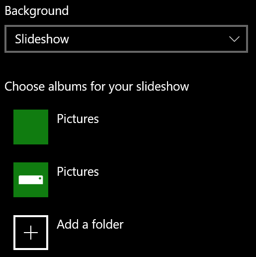

# 잠금 화면 배경 변경Change your lock screen background

- 설정 개인  >  **설정 잠금**  >  **화면으로 이동합니다.**Go to **Settings** > **Personalization** > **Lock screen**. 또는 여기를 클릭하거나 [탭합니다.](ms-settings:lockscreen?activationSource=GetHelp)Or click or tap [here](ms-settings:lockscreen?activationSource=GetHelp).

- 사용자 지정 배경 그림을  설정하려면  배경 드롭다운 목록에서 그림을 선택하고 그림을 선택하거나 **찾아보기를** 선택합니다.To set a custom background picture, select **Picture** from the **Background** drop-down list, and choose or **Browse** to the picture.

  

- 사용자 지정 그림의 슬라이드 쇼를  설정하려면 배경  드롭다운 목록에서 슬라이드 쇼를 선택하고 앨범을 선택하거나 슬라이드 쇼의 그림이 포함된 폴더를 추가합니다.To set up a slideshow of custom pictures, select **Slideshow** from the **Background** drop-down list, and choose an album or add a folder that contains the pictures for the slideshow.

  
