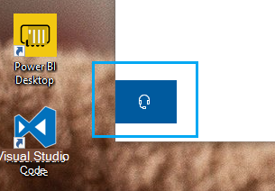

# 헤드폰 단추를 클릭하여 문의

Microsoft 지원에 문의하려면 이 앱의  왼쪽 아래 모서리에 있는 문의를 클릭하세요. 플라이아웃 창 내에서 제품 및 발급 범주를 선택한 후 올바른 지원 채널로 안내됩니다.

연락처 세션을 시작한 후에도 앱의 나머지와 계속 상호 작용할 수 있습니다. 앱 내부의 아무 곳이나 클릭하여 연락처 패널을 일시적으로 최소화할 수 있습니다. 동일한 세션으로 돌아가려면 문의하기를 **다시** 클릭합니다.
