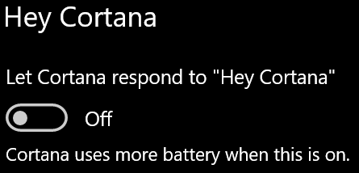

# Cortana가 사용자와 이야기하지 않고 사용자 말을 듣지 못함

작업 표시줄의 Cortana 단추나 Cortana 패널의 마이크 단추를 선택하지 않고 Cortana와 이야기할 수 있는 "안녕 코타나" 기능을 사용하려 하는 경우, 이 기능을 사용하도록 설정되어 있는지 확인합니다.

1. **시작**로 이동한 다음 **[설정 > Cortana](ms-settings:cortana?activationSource=GetHelp)** 를 선택합니다.
2. **안녕 코타나**에서 **Cortana가 "안녕 코타나"에 응답하도록 시키기** 토글을 **켜기**로 전환합니다.

**개인 정보 설정으로 인해 Cortana가 사용자의 말을 듣지 못하고 있나요?**

개인 정보 설정으로 인해 Cortana가 사용자의 음성에 응답하지 않을 수 있습니다.
- 온라인 음성 인식이 켜져있는지 확인합니다.
    - **시작**으로 이동한 후 **[설정 > 개인 정보 >음성](ms-settings:privacy-speech?activationSource=GetHelp)** 을 클릭합니다.
    - **Online 음성 인식**에서 설정을 **켜기**로 전환합니다.
- Cortana가 마이크에 액세스할 수 있는 권한을 보유하고 있는지 확인합니다. 
    - 시작으로 이동한 후 **[설정 > 개인 정보 > 마이크](ms-settings:privacy-microphone?activationSource=GetHelp)** 를 클릭합니다.
    - **마이크에 액세스할 수 있는 앱 선택**의 앱과 서비스 목록 내에서 **Cortana**를 찾아 스위치가 **켜짐**으로 토글되어 있는지 확인합니다.

또한 Cortana와 이야기하기 위해 스피커나 마이크가 작동하고 있는지 확인하세요.
