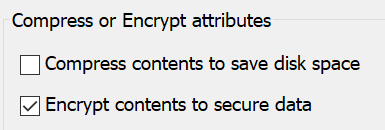

# Windows 10에서 파일 또는 폴더 암호화

BitLocker를 사용하여 전체 디스크를 암호화할 수 있지만, 개별 파일이나 폴더(및 해당 콘텐츠)만 암호화하려면 다음을 수행합니다.

1. **파일 탐색기** 에서 암호화하려는 파일 또는 폴더를 선택합니다. 이 예제에서는 두 개의 파일을 선택했습니다.

    

2. 선택한 파일을 마우스 오른쪽 단추로 클릭하고 **속성** 을 클릭합니다.

3. **속성** 창에서 **고급** 을 클릭합니다.

4. **고급 속성** 창에서 **내용을 암호화하여 데이터 보호** 확인란을 선택합니다.

    

5. **확인** 을 클릭합니다.
