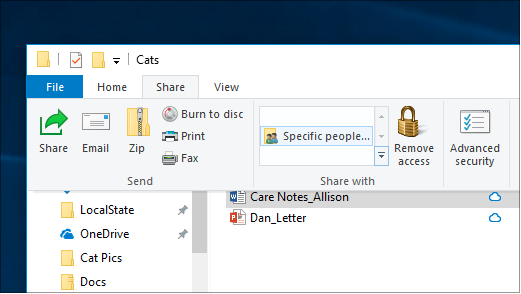
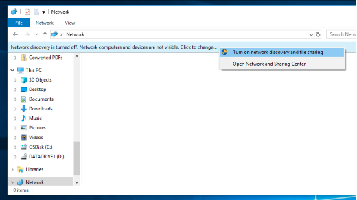

# Windows 10의 네트워크를 통해 파일 공유

**참고:** 이전에 파일 공유를 위해 홈을 사용한 경우 HomeGroup이 Windows 10(버전 1803)에서 제거되었습니다. 이제 Windows 10의 기본 제공 기능을 사용하여 프린터와 파일을 공유할 수 있습니다.

**네트워크를 통해 파일 또는 폴더를 공유하려면**

- 파일 **탐색기에서** 파일을 선택하고 > 공유  섹션의 위쪽 > 탭을  클릭하고 특정 사용자 를 **클릭합니다.**

    
          
- 여러 파일을 한 번 선택하면 동일한 방식으로 모두 공유할 수 있습니다. 폴더에도 작동합니다.

**네트워크에서 파일을 공유하는 장치를 표시하려면**

- 파일 **탐색기에서** 네트워크로 **이동하십시오.** 네트워크 검색을 사용하도록 설정하지 않은 경우 "네트워크 검색이 꺼져 있습니다..."라는 오류 메시지가 표시됩니다.

- **배너가 꺼져** 있는 네트워크 검색을 클릭한 다음 네트워크 검색 및 파일 공유 **켜기 를 클릭합니다.**

    

[네트워크를 통해 파일 공유에 대한 자세한 정보](https://support.microsoft.com/help/4092694/windows-10-file-sharing-over-a-network)

[앱, OneDrive, 전자 메일 등을 사용하여 파일 공유](https://support.microsoft.com/help/4027674/windows-10-share-files-in-file-explorer)
