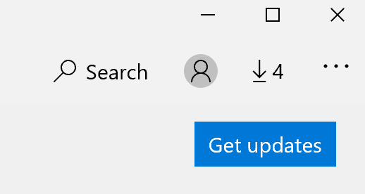

# 앱의 표시 언어 수정Fix the display language of apps

Windows 10에서 표시 언어를 변경한 후 일부 앱은 사용자가 열 때 이전 언어를 계속 사용할 수 있습니다.After you change the display language in Windows 10, some apps may still use the previous language when you open them. 이 문제는 해당 언어용 앱의 새 버전을 스토어에서 다운로드해야 하기 때문에 발생합니다.This happens because new versions of the apps for that language must be downloaded from the Store. 이 문제를 해결하려면 자동 업데이트를 기다리거나 업데이트된 버전의 앱을 수동으로 설치할 수 있습니다.To fix this problem, you can either wait for the automatic update, or you can manually install the updated version of the apps.

업데이트를 수동으로 설치하려면 **Microsoft Store를** 열고 오른쪽 상단 모서리에서 다운로드 및 업데이트를 클릭합니다. To manually install the update, open **Microsoft Store** and click **Downloads and updates** in the top right corner. 그런 다음 업데이트 **다운로드를 클릭합니다.**Then click **Get updates**. 업데이트가 완료된 후 언어가 변경되지 않은 경우 PC를 다시 시작해 시도합니다.If the language is not changed after the update is complete, try restarting your PC.

입력 및 표시 언어 설정에 대한 자세한 내용은 [Windows 10에서](https://support.microsoft.com/help/4027670/windows-10-add-and-switch-input-and-display-language-preferences)입력 및 표시 언어 설정 관리를 참조하세요.To read more about input and display language settings, see [Manage your input and display language settings in Windows 10](https://support.microsoft.com/help/4027670/windows-10-add-and-switch-input-and-display-language-preferences).
