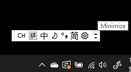
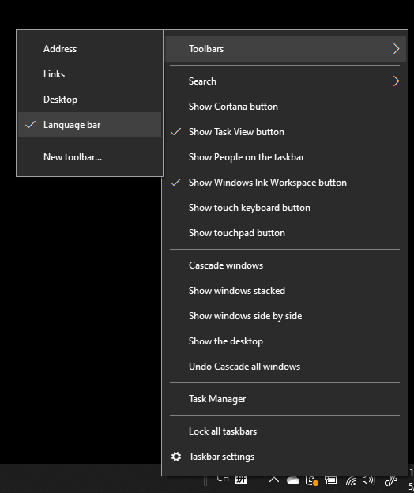
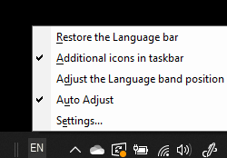

# 입력 도구 모음 숨기기, 표시 또는 다시 설정Hide, display, or reset the language bar

**입력 도구 모음을 최소화하려면 다음을 수행합니다.****To minimize the language bar:**

입력 도구 모음의 오른쪽 위 모서리에서 최소화 단추를 클릭할 수 있습니다.You can click the minimize button on the top right corner of the language bar. 또는 입력 도구 모음을 작업 표시줄로 끌어 놓으면 자동으로 최소화됩니다.Or, you can just drag the language bar to the task bar, which will automatically minimize it.

**입력 도구 모음을 팝아웃하려면 다음을 수행합니다.****To pop out the language bar:**

작업 표시줄에 입력 도구 모음을 고정하고 싶지 않은 경우, 작업 표시줄의 빈 공간을 마우스 오른쪽 단추로 클릭하고 도구 모음 메뉴에서 **입력 도구 모음** 옵션의 선택을 취소합니다.If you don't want to dock the language bar in the taskbar, right-click any empty space in the taskbar, and uncheck the **Language bar** option in the Toolbars menu. 이렇게 하면 이전 스크린샷처럼 입력 도구 모음이 작업 표시줄 외부에 나타납니다.This will make the language bar appear outside the taskbar, just like the previous screenshot.

**입력 도구 모음을 기본값으로 복원하려면 다음을 수행합니다.****To restore the language bar to default:**

도구 모음에서 언어 단추를 마우스 오른쪽 단추로 클릭하고 메뉴에서 **입력 도구 모음 복원** 옵션을 클릭합니다.Right-click the language button in the toolbar, and click **Restore the language bar** option in the menu. 이렇게 하며 기본값으로 복원됩니다.This will restore it to default.

