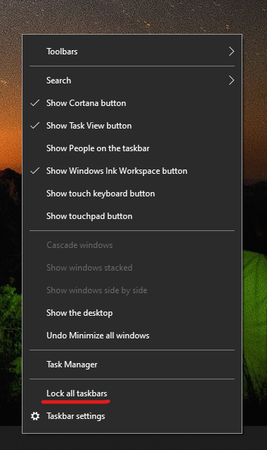

# 작업 표시줄을 바탕 화면의 한쪽 측면이나 맨 위로 이동

먼저 작업 표시줄이 잠금 해제되었는지 확인하세요. 사용자의 작업 표시줄이 잠금 해제되었는지 확인하려면 작업 표시줄의 빈 공간을 마우스 오른쪽 단추로 클릭하고 **작업 표시줄 잠금** 옆에 체크 표시가 있는지 확인하세요. 체크 표시가 있는 경우, 작업 표시줄이 잠겨 있으므로 이동할 수 없습니다. **작업 표시줄 잠금** 을 한 번 클릭하면 잠금이 해제되고 체크 표시가 제거됩니다.

작업 표시줄을 표시하는 모니터가 여러 개 있는 경우 **모든 작업 표시줄 잠금** 이 표시됩니다. 

작업 표시줄의 잠금이 해제되면 작업 표시줄의 빈 공간을 길게 누른 후 화면의 원하는 위치로 끌 수 있습니다. 작업 표시줄의 빈 공간을 마우스 오른쪽 단추로 클릭하고 **[작업 표시줄 설정](ms-settings:taskbar?activationSource=GetHelp) > 화면에서 작업 표시줄 위치** 로 이동할 수 있습니다.
