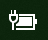

# Windows 10에서 전원 또는 배터리 아이콘이 사라짐

Windows 10 디바이스에 배터리(예: 노트북 또는 태블릿 또는 USB를 통해 UPS에 연결된 PC)가 있는 경우 일반적으로 전원/배터리 아이콘이 시계 근처의 작업 표시줄에 표시됩니다.

이 아이콘이 표시되지 않으면 숨겨져 있을 수 있습니다.

1. **[설정 > 개인 설정 > 작업 표시줄](ms-settings:taskbar?activationSource=GetHelp)** 로 이동합니다.

2. 알림 영역에서 **작업 표시줄에 표시되는 아이콘 선택**을 클릭합니다.

3. 그런 다음 목록에서 **전원** 항목을 찾아 설정을 **켬**으로 전환합니다.

    

**문제 해결**

위의 지침을 따르고 **전원** 토글이 회색으로 표시되거나 표시되지 않는 경우, 작업 표시줄의 검색 상자에서 **디바이스 관리자**를 입력하고 결과 목록에서 **디바이스 관리자**를 선택합니다. **배터리**에서 디바이스의 배터리를 마우스 오른쪽 단추로 클릭하고 **비활성화**를 클릭한 다음 **예**를 선택합니다. 몇 초 정도 기다린 다음, 배터리를 마우스 오른쪽 단추로 클릭하고 **활성화**를 클릭합니다. 그러면 디바이스가 다시 시작됩니다.

위의 지침을 수행했는데 여전히 배터리 아이콘이 작업 표시줄의 검색 상자에 표시되지 않는 경우, **작업 관리자**를 입력하고 결과 목록에서 **작업 관리자**를 클릭합니다. **이름**의 **프로세스** 탭에서 **Explorer**를 마우스 오른쪽 단추로 클릭하고 **다시 시작**을 클릭합니다.
