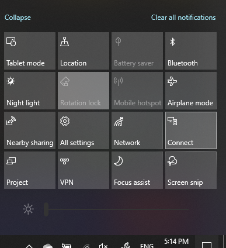

# PC에 다른 화면 표시Project to a PC

대상 디바이스(프로젝트 대상에서 “프로젝션 설정”을 검색하여 **이 PC에 프로젝션** 설정 페이지를 엽니다.On your destination device (projecting to), search for "Projection Settings" to open the Settings page of **Projecting to this PC**. 다음 사항을 확인하세요.Then make sure that:
- "일부 Windows 및 Android 디바이스는 이 PC에 프로젝션될 수 있습니다." 드롭다운 메뉴가 **항상 해제**로 설정됩니다."Some Windows and Android devices can project to this PC when you say it's OK" drop-down menu is set to **Always Off**.
- “이 PC에 프로젝트 요청” 드롭다운 메뉴는 **연결이 필요할 때 마다**로 설정됩니다."Ask to project to this PC" drop-down menu is set to **Every time a connection is required**.
- “페어링을 위해 PIN 필요” 드롭다운 메뉴는 **사용하지 않음**으로 설정됩니다."Require PIN for pairing" drop-down menu is set to **Never**.

대상 디바이스에서 **시작**으로 이동하여 “연결”을 검색하여 **연결** 앱을 시작합니다.On your destination device, launch **Connect** app by going to **Start** and search for "Connect".

프로젝트를 시도하려는 원본 디바이스에서 다음을 수행합니다.Then, on your source device that you are trying to project from:

1. **Windows 키 + A**를 눌러 작업 센터를 엽니다.Press **Windows key + A** to open Action Center.
2. **연결**을 클릭합니다.Click **Connect**.
3. 다른 화면에 표시하려는 화면을 디바이스에서 클릭합니다.Click the device you want to project the screen to.

위의 단계를 마치면, 대상 디바이스에서 원본 디바이스의 화면이 보조 모니터와 같이 표시됩니다.After the above steps, your destination device should display the screen of the source device as if it is a secondary monitor.
