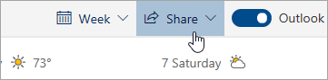

# 웹용 Outlook과 공유Sharing with Outlook on the web

일정의 페이지 맨 위에 있는 도구 모음에서  **공유**를 선택하고 공유하려는 일정을 선택합니다.From your Calendar, on the toolbar at the top of the page, select **Share**, and choose the calendar you want to share.

    

**참고**: 다른 사용자가 소유한 일정을 공유할 수 없습니다.**Note**: You can't share calendars owned by other people.

- 전자 메일로 공유 초대를 보냅니다. 상자에 일정을 공유할 사용자의 이름이나 전자 메일 주소를 입력합니다.Enter the name or email address of the person you want to share your calendar with.
- 이 사용자가 일정을 사용하는 방법을 선택합니다.Choose how you want the person to use your calendar:
    - **다른 용무 중일 때 볼 수 있음** 을 선택하면 다른 용무 중일 때 공유 대상 사용자가 이벤트 위치 등의 세부 정보를 제외한 정보를 볼 수 있습니다.**Can view when I'm busy** lets them see when you're busy but doesn't include details like the event location.
    - **제목 및 위치를 볼 수 있음** 을 선택하면 다른 용무 중일 때 공유 대상 사용자가 이벤트의 제목과 위치를 볼 수 있습니다.**Can view titles and locations** lets them see when you're busy, as well as the title and location of events.
    - **모든 세부 정보를 볼 수 있음** 을 선택하면 공유 대상 사용자가 이벤트의 세부 정보를 모두 볼 수 있습니다.**Can view all details** lets them see all the details of your events.
    - **편집 가능** 을 선택하면 일정을 편집할 수 있습니다.**Can edit** lets them edit your calendar.
    - **대리인** 을 선택하면 일정 편집하고 다른 사용자와 이를 공유할 수 있습니다.**Delegate** lets them edit your calendar and share it with others.
-  *\*공유*\*를 선택합니다.Select **Share**.
