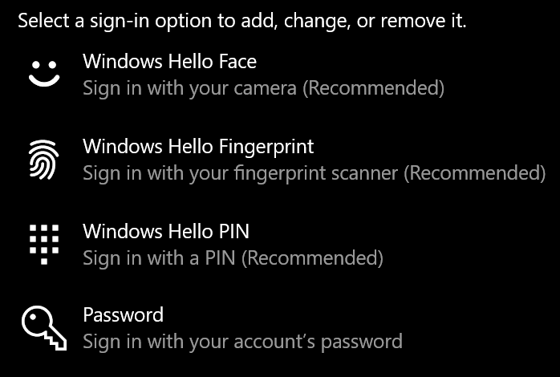
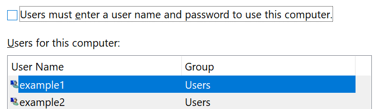

# 암호 없이 Windows 10 로그인

시작 시 암호를 Windows 방지하기 위해 PIN, 얼굴 인식 Windows Hello 지문과 같은 보안 로그인 옵션 중 하나를 사용하는 것이 좋습니다. 보안 로그인을 사용하지 않도록 설정하려는 경우 아래 "자동으로 로그인하여 Windows 10" 지침을 참조하세요.

**계정 Windows Hello 보안 대체**

로그인 **설정 > 계정 >** (또는 여기를 [클릭)로 이동하세요.](ms-settings:signinoptions?activationSource=GetHelp) 사용 가능한 로그인 옵션이 나열됩니다. 예제:

옵션 중 하나를 클릭하거나 탭하여 구성합니다. 다음에 시작하거나 잠금을 Windows 암호 대신 새 옵션을 사용할 수 있습니다. 

**자동으로 로그인하여 Windows 10**

**참고:** 자동 로그인은 편리하지만 특히 여러 사용자가 PC에 액세스할 수 있는 경우 보안 위험이 있습니다. 

1. 작업 표시줄에서 **시작** 단추를 클릭하거나 탭합니다.

2. **netplwiz를** 입력하고 Enter 키를 입력하여 사용자 계정 창을 여십시오.

3. 사용자 **계정에서** 계정이 시작될 때 자동으로 로그인할 Windows 클릭합니다.

4. "사용자가 이 컴퓨터를 사용하려면 사용자 이름과 암호를 입력해야 합니다." 확인란의 선택을 선택하지 않습니다.

    

5. **확인** 을 클릭합니다. 선택한 계정의 암호를 입력하고 확인해야 합니다. **확인** 을 클릭하여 작업을 마칩니다. 다음에 Windows 10 시작하면 선택한 계정에 자동으로 로그인됩니다.
