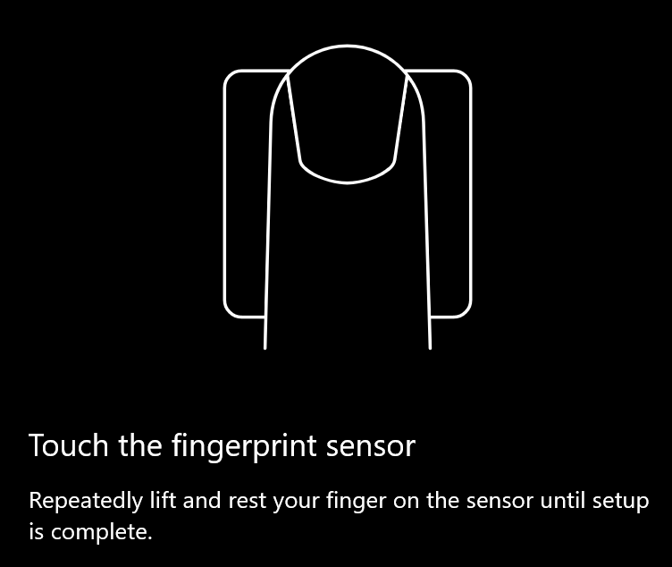
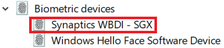

# Windows 10에서 지문 잠금 해제 옵션 사용Use fingerprint unlock option in Windows 10

**Windows Hello 지문 사용****Enable Windows Hello Fingerprint**

지문을 사용하여 Windows 10의 잠금을 해제하려면 하나 이상의 손가락을 추가하여(Windows에서 인식할 수 있도록) Windows Hello 지문을 설정해야 합니다.To unlock Windows 10 using your fingerprint, you need to set up Windows Hello Fingerprint by adding (letting Windows learn to recognize) at least one finger. 

1. 설정 > 계정 > **로그인 옵션으로** 이동합니다(또는 여기를 [클릭하십시오).](ms-settings:signinoptions?activationSource=GetHelp)Go to **Settings  > Accounts > Sign-in options** (or click [here](ms-settings:signinoptions?activationSource=GetHelp)). 사용 가능한 로그인 옵션이 나열됩니다.Available sign-in options will be listed. 예시:For example:

    

2. **Windows Hello 지문을 클릭하거나 탭한** 다음 설정 **을 클릭합니다.**Click or tap **Windows Hello Fingerprint**, then click **Set up**. Windows Hello 설정 창에서 시작 **을 클릭합니다.**In the Windows Hello setup window, click **Get started**. 지문 센서가 활성화됩니다. 센서에 손가락을 대어 두는 것이 요청됩니다.The fingerprint sensor will activate, and you'll be asked to place your finger on the sensor:

   

3. 지침에 따라 손가락을 반복적으로 스캔할 것을 요청합니다.Follow the instructions, which will ask you to repeatedly scan your finger. 이 완료되면 로그인에 사용할 수 있는 다른 손가락을 추가할 수 있습니다.When this is finished, you'll have the option of adding other fingers you may want to use for sign-in. 다음에 Windows 10에 로그인하면 지문을 사용하여 로그인할 수 있습니다.Next time you sign in to Windows 10, you will have the option of using your fingerprint to do so.

**Windows Hello Fingerprint를 로그인 옵션으로 사용할 수 없습니다.****Windows Hello Fingerprint not available as a sign-in option**

Windows Hello 지문이 로그인 옵션에 옵션으로 표시되어 있지 않은 경우 Windows가 PC에 연결된 지문 판독기/스캐너를 인식하지 못하거나 시스템 정책에서 사용을 차단하는 것입니다(예: PC가 작업 공간에서 관리하는 경우). If Windows Hello Fingerprint is not shown as an option in **Sign-in options**, it means Windows is not aware of any fingerprint reader/scanner attached to your PC, or that a system policy prevents its use (if for example your PC is managed by your workplace). 문제 해결:To troubleshoot: 

1. 작업 **표시줄에서** 시작 단추를 선택하고 장치 **관리자를 검색합니다.**Select the **Start** button in the Taskbar and search for **Device Manager**.

2. 장치 관리자를 클릭하거나 **탭하여 를 니다.**Click or tap to open **Device Manager**.

3. 장치 관리자에서 확장형을 클릭하여 생체 인식 장치를 확장합니다.In Device Manager, expand Biometric devices by clicking its chevron.

   

4. 지문 스캐너는 Synaptics WBDI 스캐너와 같은 생체 인식 장치로 나열해야 합니다.Your fingerprint scanner should be listed as a biometric device, such as the Synaptics WBDI scanner:

   

5. 지문 스캐너가 표시되어 있지 않고 스캐너가 PC에 통합되어 있는 경우 PC 제조업체의 웹 사이트로 이동하세요.If your fingerprint scanner is not shown, and the scanner is integrated into your PC, go to the PC manufacturer's website. PC 모델에 대한 기술 지원 섹션에서 설치할 수 있는 스캐너에 대한 Windows 10 드라이버를 검색합니다.In the technical support section for your PC model, search for a Windows 10 driver for a scanner that you can install.

6. 스캐너가 PC와 분리된 경우(USB를 통해 연결) 스캐너 제조업체의 웹 사이트로 이동하여 사용하는 스캐너 모델에 대한 Windows 10 장치 드라이버 소프트웨어를 찾아 설치합니다.If the scanner is separate from the PC (attached via USB), go to the scanner manufacturer's website to find and install Windows 10 device driver software for the scanner model you have.
