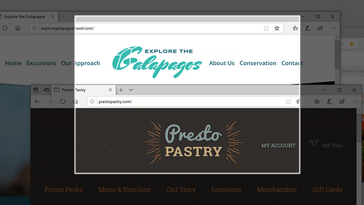
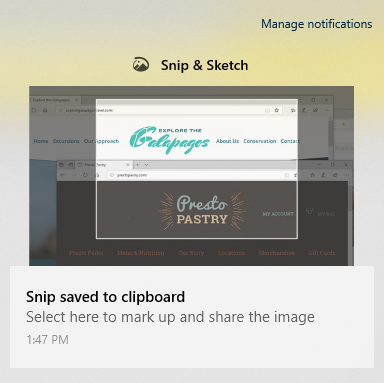

# Snip & 스케치를 사용하여 이미지를 캡처, 표시 및 공유

화면 스케치는 이제 **Snip & 스케치입니다.** **빠르게 snip을 찍기** 위해 :

1. 로고 **Windows + Shift + S를 누르고 있습니다.** 화면이 어둡게 표시되고 커서가 십자형으로 표시됩니다. 

2. 복사할 영역 가장자리에 있는 지점을 선택하고 커서를 마우스 왼쪽 단추로 클릭합니다. 

3. 커서를 이동하여 캡처할 영역을 강조합니다. 캡처한 영역이 화면에 표시됩니다.

   

잘라 넣은 이미지는 클립보드에 저장되어 전자 메일이나 문서에 붙여넣을 준비가 됩니다. 

**이미지를 편집하거나 보시고 싶은 경우:** 

- 작업 표시줄의 오른쪽에 있는 알림 아이콘을 클릭합니다. 그런 다음 방금 캡처한 사진을 클릭합니다. 스니프가 스케치 앱의 Snip & 열립니다.

   
