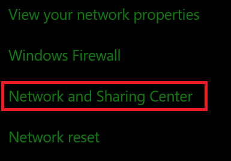
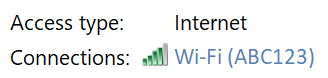
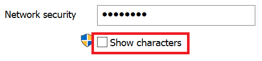

# Windows 10에서 Wi-Fi 네트워크 암호 보기

1. Windows 10 PC가 Wi-Fi 네트워크에 연결되어 있는지 확인합니다.

2. 설정 > 네트워크 & **>** 상태로 이동하거나 여기를 클릭하거나 탭하여 지금 이동하세요.) 

3. **네트워크 및 공유 센터** 를 클릭합니다.

    

4. 네트워크 **및 공유 센터에서** 연결 옆에 무선 네트워크 이름이 표시됩니다.  예를 들어 네트워크 이름이 "ABC123"인 경우 다음이 표시될 수 있습니다.

    

    무선 네트워크 이름을 클릭하여 상태 Wi-Fi 열 수 있습니다. 

5. 상태 Wi-Fi **에서** 무선 속성 을 클릭하고 보안 탭을 **클릭하고** 문자 **표시를 선택합니다.**

    

